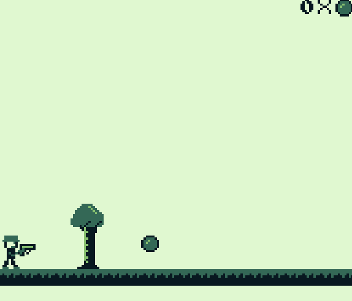

# Gameboy-Game

This is a simple game made in z80 assembly for the Gameboy. The intent was to understand the basics of assembly and low-level hardware.

### Usage:

#### Requirements:
- Git
- [RGBDS (Gameboy assembler/linker)](https://github.com/gbdev/rgbds/releases)
- [BGB (Gameboy emulator)](https://bgb.bircd.org/#downloads)

#### Build:
- Run Makefile

[Original repository](https://github.com/Isam-Ilyas29/Gameboy-Game)